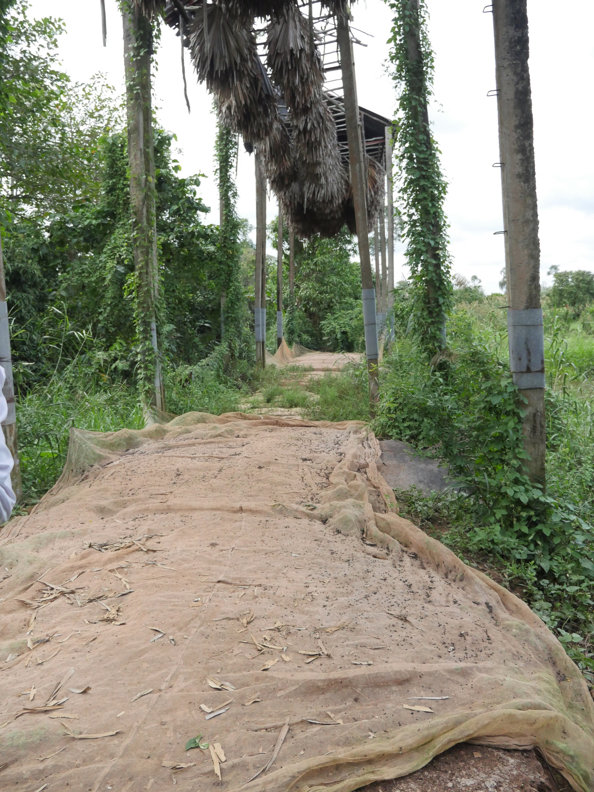
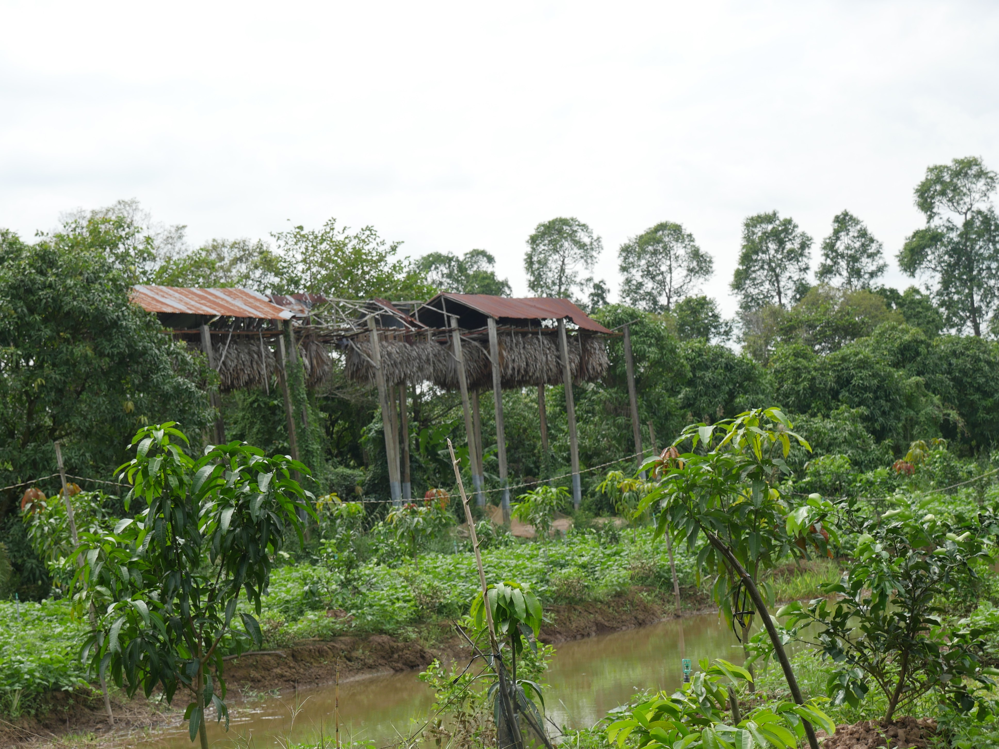

```{r setup, include=FALSE, message = FALSE}
knitr::opts_chunk$set(
	echo = FALSE,
	message = FALSE,
	warning = FALSE
)

library(tidyverse)
library(here)
library(kableExtra)
library(leaflet)
library(magrittr)
```


```{r questionnaire-data, echo=FALSE, message=FALSE, warning=TRUE}
bh <- read_csv(here("data", "bat_harvester_questionnaire.csv")) %>%
  mutate_at(vars("site_latitude", "site_longitude"), as.numeric) %>%
  mutate(depth_guano = if_else(depth_guano == "30-Nov", "11-30", depth_guano),
         depth_guano = if_else(depth_guano == "10-Jun", "6-10", depth_guano))

sites <- bh %>%
  select(site_name, local_site_name, country, site_latitude, site_longitude)

risk <- read_csv(here("data", "harvester_summary.csv")) %>% 
  mutate(exp_all = (exp_guano + exp_collect + exp_ppe + exp_wash)/4) %>%
  mutate(days_per_year = days_per_year*365) %>%
  mutate(duration_harvest_year = duration_harvest_year/60) %>%
  mutate(total_guano = guano_person_year * number_of_harvesters) %>%
  mutate(months_harvested = case_when(
    str_count(months_harvested, ";") == 11 ~ "Jan-Dec",
    str_detect(months_harvested, "January; February; March; October; November; Decembe")  ~ "Jan-Mar, Nov-Dec",
    str_detect(months_harvested, "March; April; May; November; December") ~ "Mar-May, Nov-Dec",
    str_detect(months_harvested, "May; June; July; August") ~ "May-Aug",
    TRUE ~ "once a year"
  )) %>%
  mutate_at(vars(contains("exp")), funs(round(., 2))) %>%
  mutate_at(c('guano_person_month', 'guano_person_year', 'duration_harvest_year', 'total_guano'),
            scales::comma_format(big.mark = ",")) %>%
  left_join(sites)

```

### General Site Information

As of  `r format(Sys.time(), '%B %d, %Y')`, data on bat guano-harvester interactions is available for `r bh %>% select(country) %>% unique() %>% nrow()` countries: `r unique(bh$country)`. All are PREDICT sites except Kimpese/Weene in the Democratic Republic of Congo.  

```{r leaflet, echo = FALSE, message = FALSE}
popup <- paste0(risk$site_name, "<br/>Annual Guano Volume (kg): ", risk$total_guano)

leaflet(risk) %>% 
  addTiles() %>% 
  addMarkers(~site_longitude, ~site_latitude, 
             popup = popup)
```

```{r sites, echo = FALSE, message = FALSE}
options(knitr.kable.NA = '')
bh %>% select("Site Name" = local_site_name, "Country" = country,
              "Type" = site_type) %>%
  kable(format = 'markdown', padding = 1L)
```

`r str_which("cave", bh$site_type) %>% length()` of the `r nrow(bh)` sites are at the *cave* interface, where bat guano is harvested from fecal matter of bats roosting in caves. Only caves were access-controlled, with some sites (Myanmar) primarly functioning as a religious temple, while others required a permit or verbal permission to enter. 

`r str_which("farm", bh$site_type) %>% length()` of the `r nrow(bh)` sites are at the *farm* interface, where bat guano is harvested from artificial roosts set up below tree-like structures (Fig. 1, below). Both farm sites had artifical roosts composed of sugar palm leaves. 

{ width=50% }
{ width=40% }

Bats were present during harvest at all sites. Most roosts were 1,000 - 5,000 bats in size, except the Viet Nam cave site where roost size was estimated between 100,000 to million, dependent on nseason. 

```{r bat_size, fig.cap = "Fig 2. Roost sizes across sites"}
roost <- bh %>%
  select(site_name, bat_roost_size) %>%
  mutate(bat_roost_size = str_replace_all(bat_roost_size, ">|-3 million", ""),
         bat_roost_size = as.numeric(bat_roost_size))

ggplot(roost) + geom_point(aes(x = roost$site_name, y = format(roost$bat_roost_size, big.mark = ",", scientific = FALSE))) +
  theme(axis.text.x = element_text(angle = 90, hjust = 1), axis.title.x = element_blank()) +
  ylab("Roost Size") + xlab("") + theme_minimal()
```


#### Harvesters

The DRC and Vietnam cave sites had the highest number of harvesters, and some of the highest frequencies of harvest. All Viet Nam sites were harvested frequently, both at cave and farm sites. 

```{r harvesters, echo = FALSE, message = FALSE}
bh %>% select(site_name, local_site_name, number_of_harvesters, duration_active_harvest, frequency_of_harvesting) %>%
  mutate(duration_active_harvest = 
           str_replace_all(duration_active_harvest, "60-210 minutes; |30 minutes; |typical|120 minutes; |300 minutes; |15-|20-", "")) %>%
  rename("Site Name" = site_name, 
         "Local Site Name" = local_site_name,
         "Number of Harvesters" = number_of_harvesters,
         "Duration of Harvesting" = duration_active_harvest,
         "Frequency of Harvesting" = frequency_of_harvesting) %>%
  kable(format = 'html') %>%
  kable_styling(position = "left")
```

All harvesters were local in origin, although Myanmar Caves 2 and 3 also had seasonal harvesters come in. Non-harvesters were present at the guano harvesting areas for all sites except the DRC cave; this included locals at all sites, children at all Myanmar sites and at the Viet Nam Cave site, and 10-20 tourists per day at Myanmar Cave 3 (Saddan Cave) site. Limits to harvesting included bat migration elsewhere (5/7 sites), high water levels (2 cave sites), low demand (2 cave sites) , and hunting of bats for food by locals (cave and farm site in Viet Nam). 

Activities at all sites included harvesting, packaging, and storing guano. Selling guano also occurred at all Myanmar and Viet Nam sites. 

```{r months_harvested, echo = FALSE}
months <- bh %>% select(site_name, months_harvested)
month_long <- months %>% spread(site_name, months_harvested)
```

```{r site_activities, echo = FALSE}
activities <- bh %>% select(site_name, activities_around_site)
activities_long <- activities %>% spread(site_name, activities_around_site)
```

### Guano

Sites in Myanmar were harvested the least frequently, ranging from 3 times/month to once a year. Despite this, MMR-Cave-2 (Buffalo Cave) had the highest collection volume at approximately 54,000 kg annually. Collection occured daily or several times a week at the DRC and Viet Nam sites, with volumes ranging from 312 - 3000 kg collected per year. 

### Harvester Exposures

Exposures to guano vary by site based on frequency, duration, and volume of harvest, as well as in the use of tools, protective protective equipment (PPE), and water, sanitation, and hygiene practices (WASH) for harvesting. The sites ranged in their production levels and purposes for guano harvest; 1 harvester at VNM-Farm-1 harvested 156 kg of guano annually compared to 50 harvesters at the DRC-Cave-1 site that collected a similar amount of guano in a year. Duration of harvest spanned from 4 hours to 1,095 hours annually, guano was harvested from once a year to daily, and annual volumes ranged from 156 to 7,300 kg. VNM-Cave-1 had the highest level of guano harvesting, in frequency, duration, and volume connected.

```{r risk-explanation}

collect <- read_csv(here("data", "collect_summary.csv")) 
ppe <- read_csv(here("data", "ppe_summary.csv"))
wash <- read_csv(here("data", "wash_summary.csv"))

risk2 <- risk %>%
  mutate(exp_collect = paste0(collect$tools_shovels, " using shovels; ", 
                              collect$tools_spades, " using spades; " ,
                              collect$tools_brooms, " using brooms; ",
                              collect$tools_hands_only, " using only hands"),
         exp_ppe = paste0(ppe$ppe_gloves, " using gloves; ",
                          ppe$ppe_makeshift_mask, " wearing makeshift mask; ",
                          ppe$ppe_goggles, " wearing goggles; ",
                          ppe$ppe_shoes, " wearing shoes; ",
                          ppe$ppe_clothing, " wearing clothing for harvesting; ",
                          ppe$ppe_mask, " wearing mask"),
         exp_wash = paste0(wash$washing, " washing; ",
                           wash$soaping, " using soap; ",
                           wash$wash_shoes, " washing shoes; ", 
                           wash$wash_feet, " washing feet; ", 
                           wash$wash_hands, " washing hands; ",
                           wash$wash_body, " washing body")) %>% 
  select("Site Name" = site_name, 
         "Frequency of Harvesting (days per year)" = days_per_year,
         "Duration of Harvesting (hours per year)" = duration_harvest_year, 
         "Guano Collected (kg per year)" = guano_person_year,
         "Collection Exposures" = exp_collect,
         "PPE Exposures" = exp_ppe,
         "WASH Exposures" = exp_wash,
         "Months Harvested" = months_harvested,
         "Number of Harvesters" = number_of_harvesters,
         "Total Guano Collected (kg)" = total_guano) 
risk2 %>%
    kable(format = "html", align = "l") %>%
  kable_styling(bootstrap_options = "striped") %>%
  add_header_above(c(" ", "Individual Exposures" = 7, "Population Exposures" = 2)) %>%
  scroll_box(width = "100%", height = "100%")
```

The exposure groups are composed of the following variables:

1) Collection Exposures

*Collection Exposures* are the method that harvesters used to collect the guano: 

-   Use of shovel
-   Use of spade 
-   Use of broom 
-   Use of hands only

2) Personal and Protective Equipment (PPE) Exposures

*PPE Exposures* are protective factors related to the wearing of protective equipment and clothing:

-   Wearing gloves
-   Wearing goggles
-   Wearing shoes
-   Wearing a mask or makeshift mask 
-   Wearing shoes
-   Wearing clothing specifically for guano harvesting

3) Water, Sanitation and Hygiene (WASH) Exposures

*Water, Sanitation, Hygiene* factors refer to the availability and use of water and soap for washing and are a summary of the following:

-   Washing after harvesting
-   Use of soap for washing
-   Washing of shoes post guano exposure
-   Washing of feet post guano exposure
-   Washing of hands post guano exposure
-   Washing of body post guano exposure

### Observations and Notes

Often, though water was not available directly on site for washing, harvesters washed their bodies in nearby rivers (Myanmar Cave Sites 1 and 2, Viet Nam Cave site). Another risky practice not explicitly covered in the questionnaire but derived from responses is eating lunch and snacks in the cave during breaks from harvesting guano. 

### Next Steps

-   Review of data by country teams
-   Determine importance and weight of variables to harvester risk
-   Define risk reduction by practices, equipment, and collection method